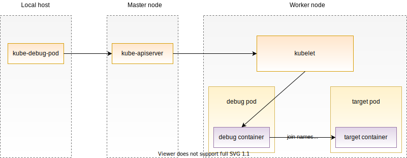

# kube-debug-pod

*kube-debug-pod* tool allows you to attach troubleshooting tools to running Kubernetes and/or OpenShift pods.

## How does it work?

The process of troubleshooting a running pod using *kube-debug-pod* can be divided into the following steps:

1. *kube-debug-pod* creates a privileged pod using a user-supplied container image. This debug pod is placed on the same cluster node where the target pod is running.
2. User's terminal is attached to the debug pod.
3. The shell running in the debug pod joins the Linux namespaces (*uts*, *ipc*, *net*, *pid*, and *cgroup*) of the target container.
4. User runs troubleshooting tools located on his/her container image, enjoying direct access to the processes running in the target container.
5. After the user is finished with troubleshooting, the debug pod is deleted.



## Installing kube-debug-pod

Golang >= 1.13 is required. Build *kube-debug-pod* using the command:

```
$ make build
```
Copy the resulting binary to your $PATH:

```
$ cp bin/kube-debug-pod /usr/local/bin
```

## Usage

Check out the built-in help:

```
$ kube-debug-pod -h
kube-debug-pod, complete documentation is available at https://github.com/noseka1/kube-debug-pod

Usage:
  kube-debug-pod POD [flags]

Flags:
  -c, --container string   Target container name; defaults to first container in pod
  -h, --help               help for kube-debug-pod
      --image string       Image used by the debug pod. (default "centos")
      --init-container     Target is an init container; defaults to false
  -n, --namespace string   Target namespace
```

The following sample session demonstrates attaching to an `apiserver-7484t` pod that is running in the `openshift-apiserver` namespace:

```
$ kube-debug-pod apiserver-7484t --namespace openshift-apiserver
2020/04/18 13:41:07 Starting pod/apiserver-7484t-debug-4ysar on node ip-10-0-157-32.us-west-2.compute.internal using image centos ...
2020/04/18 13:41:18 Welcome to the debug pod. Please, run the following commands to join the namespaces of the target container:
2020/04/18 13:41:18 PID=$(chroot /rootfs crictl inspect fefdc3d0b43074284217c26470cbc3ad9a9543cfab28ab60545c7f439cf8eafc | sed --quiet --expression 's/"pid": \([[:digit:]]\+\).*/\1/p')
2020/04/18 13:41:18 nsenter --uts --ipc --net --pid --cgroup --no-fork --target $PID
2020/04/18 13:41:18 mount -t proc proc /proc || true
If you don't see a command prompt, try pressing enter.
sh-4.4# PID=$(chroot /rootfs crictl inspect fefdc3d0b43074284217c26470cbc3ad9a9543cfab28ab60545c7f439cf8eafc | sed --quiet --expression 's/"pid": \([[:digit:]]\+\).*/\1/p')
sh-4.4# nsenter --uts --ipc --net --pid --cgroup --no-fork --target $PID
[root@apiserver-7484t /]# mount -t proc proc /proc || true
[root@apiserver-7484t /]# ps aux
USER         PID %CPU %MEM    VSZ   RSS TTY      STAT START   TIME COMMAND
root           1  0.7  1.4 991792 223548 ?       Ssl  Apr14  45:57 openshift-apiserver start --config=/var/run/configmaps/config/config.yaml -v=2
root          35  0.0  0.0  43960  3384 pts/0    R+   20:41   0:00 ps aux
[root@apiserver-7484t /]# exit
logout
sh-4.4# exit
exit
2020/04/18 13:43:39 Removing debug pod ...
```

## Tools image requirements

Your tools image can contain degugging/troubleshooting tools of your choice. In addition to that, make sure that you include the following utilities in your image as well:

* `/bin/sh`
* `chroot`
* `nsenter`
* `mount`

There are many tools images available out there. If you are troubleshooting on OpenShift, you can checkout my [openshift-toolbox](https://github.com/noseka1/openshift-toolbox) tools image.

## Limitations

* User must be permitted to create privileged containers.
* _Works on the CRI-O based clusters only (containerd not supported at the moment)_. This will be resolved in the future versions of *kube-debug-pod*.

## References

Kubernetes feature [Ephemeral Containers](https://github.com/kubernetes/enhancements/issues/277) that is currently in development.

Similar projects:

* [aylei/kubectl-debug](https://github.com/aylei/kubectl-debug)
* [verb/kubectl-debug](https://github.com/verb/kubectl-debug)
* [huazhihao/kubespy](https://github.com/huazhihao/kubespy)
